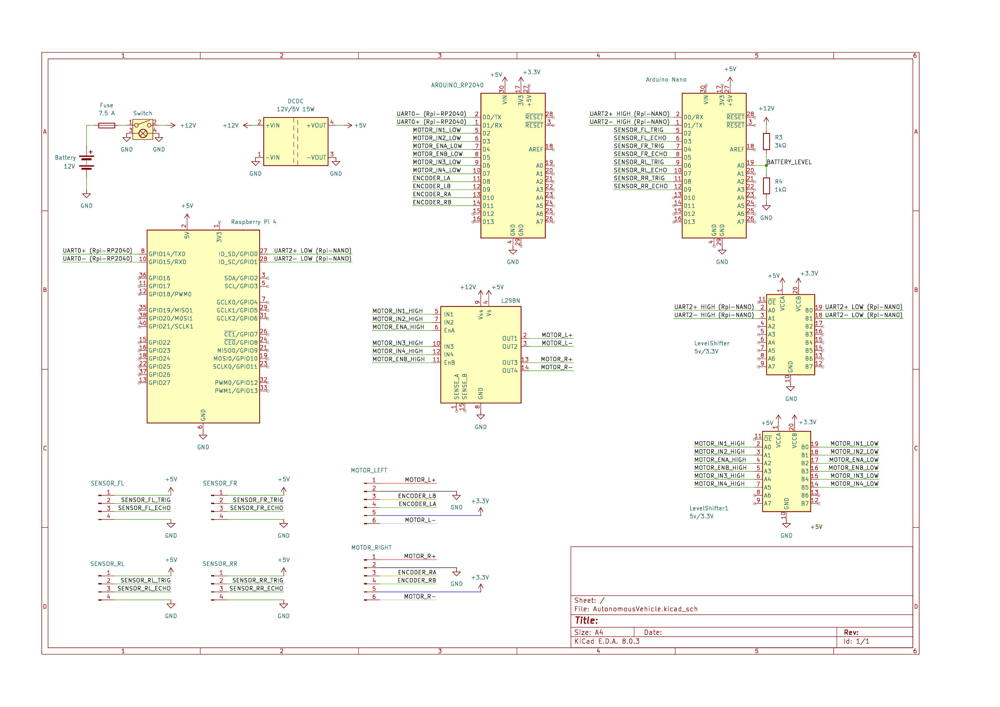

## Components:
### Power:
 - Battery 12v 2200mAh 
 - DCDC Converter 12v-5v 15W 
 - Fuse 7.5A 
 - Power Switch

### Controllers:
 - Raspberry PI
 - Arduino RP2040 Connect
 - Arduino NANO

### Motors:
 - L298N Motor Driver
 - DC Motor 12v 170rpm (x2)
    - current: 60mA free, 450mA load, 1300mA stall 

### Sensors:
 - Slamtec RPLIDAR C1 
 - Ultrasonic Sensor HCSR04 (x4)
 - Digital Camera OV5647, 160° 5MP

