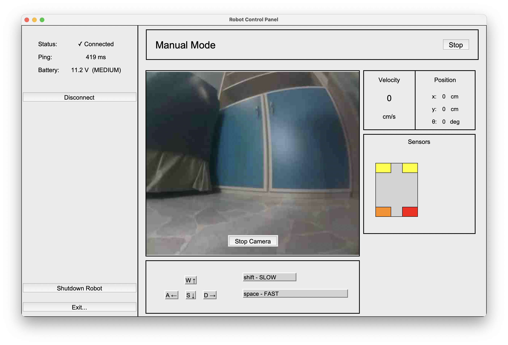

# Two-Wheeled Robot

## Introduction
Manual control via a **graphical interface** with camera and sensors feedback.  
**Odometry** and **obstacle detection** capabilities for accurate positioning and movement.  
Working on expanding the project with LIDAR integration, **autonomous mapping** and **real-time path planning** capabilities.  


### Main Components
- Raspberry Pi 
- Arduino nano
- Arduino RP2040 Connect
- [Full components list...](docs/compnents_list.md)

## Software Details
### Program Structure
#### Main Controller  (RaspberryPi)
Controls the central loop of the robot, handles connections with client and robot controllers.  
[[main.py](src/raspberry_pi/main.py), [manual.py](src/raspberry_pi/manual.py)]
```
MAIN LOOP:
- check battery voltage
- if main socket has received:
  - handle command
- IDLE/MANUAL/AUTONOMOUS
- data and camera transmit

MANUAL:
- get sensors data
- get manual socket command
- calculate moto powers
- send motor commands
```
#### Sensor Controller (Arduino RP2040)
Controls 4 distance sensors, 2 motor encoders and battery voltage.
Calculates robot odometry with motor encoders (expanding with IMU).
Connects to RaspberryPI with UART2 (serial).  
[[arduino code](src/rp2040/main_serial.ino),  [raspberrypi driver](src/raspberrypi/rp2040.py)]
```
RP2040 LOOP (50Hz):
- update battery
- update encoders and odometry
- update distance sensors

RP2040 ON_REQUEST:
- send battery voltage (V)
- send obstacle distances (cm, cm, cm, cm)
- send odometry (cm/s, deg/s, cm, cm, deg)
```
#### Motor Controller (Arduino Nano)
Controls DC motors.
Connects to RaspberryPI with UART0 (serial).  
[[arduino code](src/nano/main.ino),  [raspberrypi driver](src/raspberrypi/nano.py)]
```
NANO LOOP (50Hz):
- read from serial
- set motor powers
```
#### Developer Console (Client)
Graphical interface to allow the end-user to remotely control the robot while receiving camera streaming and sensors feedback.
Connects to RaspberryPI with multiple socket connections.

### Interfaces & Connections

#### Sockets (DevConsole <-> RaspberryPI):
- main: TCP (req/res)
- manual: UDP (bidirect)
- camera: UDP (monodirect)
```
MAIN
console (request) -->  raspberrypi (response)
"P"          -->    "P <battery_v>"             // Ping
"M <0/1>"    -->    "OK <manual_port>"          // Manual Start/Stop
"C <0/1>"    -->    "OK <camera_port>"          // Camera Start/Stop
"E"          -->    "OK"                        // Close Connection

MANUAL
console: "<boost> <x> <y>"                   // commands (boost, x, y ∈ [-1,0,1])
raspberrypi: "D <fl> <fr> <rl> <rr>",        // obstacle distance (cm, cm, cm, cm)
             "E <vx> <vt> <x> <y> <theta>",  // encoders odometry (cm/s, deg/s, cm, cm, deg)
```

#### Serial:
- arduino nano: UART0
- arduino rp2040: UART2


